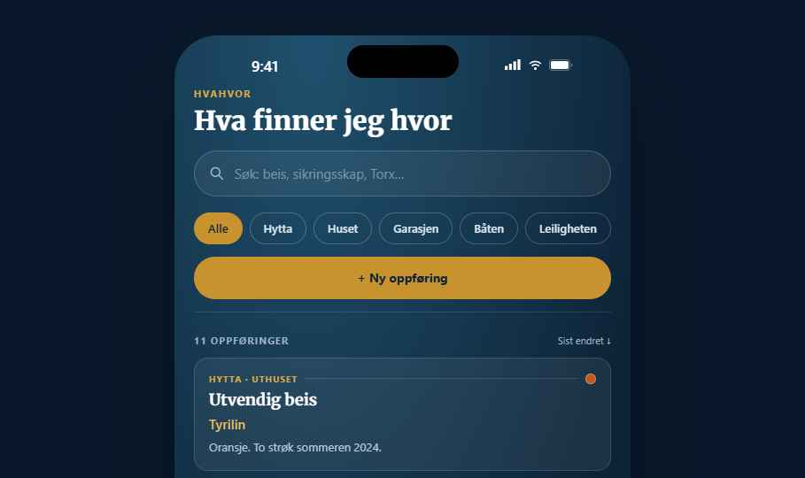
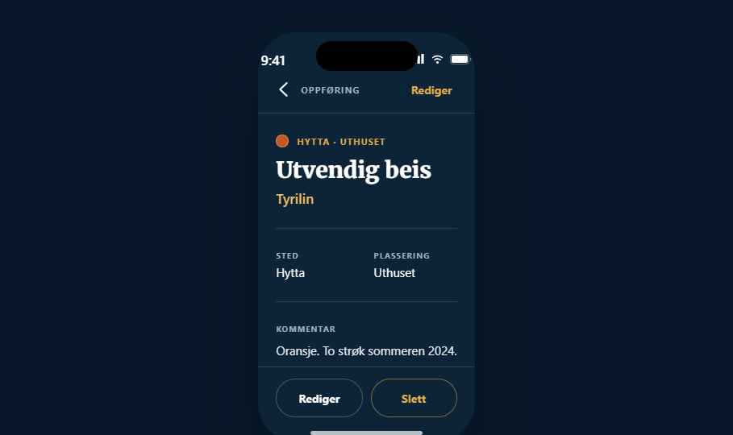
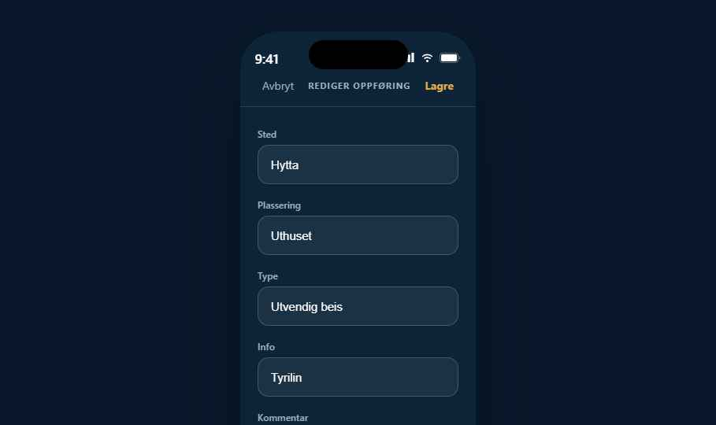

<p align="center">
  
</p>

<h1 align="center">HvaHvor</h1>

<p align="center">
  Personlig register for "hva er hvor" — maling, verktøy, deler, reservedeler.<br>
  Ingen innlogging, ingen backend. Alt lagres lokalt på telefonen.
</p>

<p align="center">
  
</p>

## Skjermbilder

Bygget etter designspec med Merriweather/Noto Sans, gullaksent og mørk marineblå bakgrunn. Bildene under er fra det opprinnelige design-prototypen appen ble bygget etter — SwiftUI-appen matcher dem pikselnært, men er ikke selve kjørende appen (ingen Mac/simulator tilgjengelig i byggemiljøet).

<p align="center">
  
  
  
</p>

## Funksjoner

- **Søk** — live substring-søk i Sted, Plassering, Type, Info og Kommentar
- **Stedsfilter** — chips for å filtrere på ett Sted av gangen, kombineres med søk
- **Sortering** — Sist endret, Sted (A–Å) eller Type (A–Å)
- **Eksport** — hele registeret som CSV via delingsarket (Filer, e-post, AirDrop …)
- **Ny/rediger/slett** — full CRUD med bekreftelse før sletting
- **Fargemerking** — valgfri kosmetisk fargeprikk per oppføring

## Teknisk

- **Swift + SwiftUI**, iOS 17+
- **SwiftData** for lokal persistens (ingen nettverk, ingen ekstern database)
- Bundlede fonter: [Merriweather](https://github.com/google/fonts/tree/main/ofl/merriweather) og [Noto Sans](https://github.com/google/fonts/tree/main/ofl/notosans) (SIL Open Font License)

## Kom i gang

Åpne `HvaHvor.xcodeproj` i Xcode, velg ditt eget team under Signing & Capabilities, og bygg (⌘B) eller kjør (⌘R) til simulator eller enhet.

GitHub Actions bygger prosjektet automatisk ved hver push (`.github/workflows/ios-build.yml`) — se badgen over eller [Actions-fanen](https://github.com/kay56robin-collab/Hvahvor/actions) for status.

## Prosjektstruktur

```
HvaHvor/
├── HvaHvorApp.swift        # App-inngang, SwiftData ModelContainer
├── Entry.swift             # @Model datamodell
├── Theme.swift             # Designtokens (farger, typografi)
├── HomeView.swift          # Søk, filter, sortering, eksport, liste
├── DetailView.swift        # Full visning av én oppføring
├── EntryFormView.swift     # Ny/rediger-skjema
├── Components.swift        # Gjenbrukbare views
├── Fonts/                  # Merriweather.ttf, NotoSans.ttf
└── Assets.xcassets/        # App-ikon, launch screen, farger
```
